```mermaid
flowchart TD
    skills("Skills")

    %% Backend Group
    subgraph Backend [BackEnd      **]
        style Backend fill:#003366,stroke:#002244,stroke-width:2px,font-size:20px
        B1[Node.js]
        style B1 fill:#0066cc,stroke:#005bb5,stroke-width:1px,font-size:18px
        B2[Express.js]
        style B2 fill:#0066cc,stroke:#005bb5,stroke-width:1px,font-size:18px
        B3[PostgreSQL]
        style B3 fill:#0066cc,stroke:#005bb5,stroke-width:1px,font-size:18px
        B4[Supabase]
        style B4 fill:#0066cc,stroke:#005bb5,stroke-width:1px,font-size:18px
        B5[RESTful API]
        style B5 fill:#0066cc,stroke:#005bb5,stroke-width:1px,font-size:18px
        B6[MongoDB]
        style B6 fill:#0066cc,stroke:#005bb5,stroke-width:1px,font-size:18px
        B7[API Gateway]
        style B7 fill:#0066cc,stroke:#005bb5,stroke-width:1px,font-size:18px
    end
    skills --> Backend

    %% DevOps Group
    subgraph DevOps [DevOps      **]
        style DevOps fill:#003d33,stroke:#002222,stroke-width:2px,font-size:20px
        D1[AWS]
        style D1 fill:#339966,stroke:#2b7a47,stroke-width:1px,font-size:18px
        D2[Terraform]
        style D2 fill:#339966,stroke:#2b7a47,stroke-width:1px,font-size:18px
        D3[Docker]
        style D3 fill:#339966,stroke:#2b7a47,stroke-width:1px,font-size:18px
        D4[API Gateway]
        style D4 fill:#339966,stroke:#2b7a47,stroke-width:1px,font-size:18px
        D5[Cognito]
        style D5 fill:#339966,stroke:#2b7a47,stroke-width:1px,font-size:18px
        D6[RDS]
        style D6 fill:#339966,stroke:#2b7a47,stroke-width:1px,font-size:18px
        D7[VPC]
        style D7 fill:#339966,stroke:#2b7a47,stroke-width:1px,font-size:18px
        D8[Lambda]
        style D8 fill:#339966,stroke:#2b7a47,stroke-width:1px,font-size:18px
    end
    Backend --> DevOps

    %% Frontend Group
    subgraph FrontEnd [FrontEnd      **]
        style FrontEnd fill:#003333,stroke:#002222,stroke-width:2px,font-size:20px
        F1[React.js]
        style F1 fill:#4d94ff,stroke:#2a5caa,stroke-width:1px,font-size:18px
        F2[Next.js]
        style F2 fill:#4d94ff,stroke:#2a5caa,stroke-width:1px,font-size:18px
        F3[HTML/CSS]
        style F3 fill:#4d94ff,stroke:#2a5caa,stroke-width:1px,font-size:18px
        F4[JavaScript]
        style F4 fill:#4d94ff,stroke:#2a5caa,stroke-width:1px,font-size:18px
        F5[TypeScript]
        style F5 fill:#4d94ff,stroke:#2a5caa,stroke-width:1px,font-size:18px
        F6[CSS Frameworks]
        style F6 fill:#4d94ff,stroke:#2a5caa,stroke-width:1px,font-size:18px
        F7[Mobile Development]
        style F7 fill:#4d94ff,stroke:#2a5caa,stroke-width:1px,font-size:18px
    end
    DevOps --> FrontEnd

    %% Automation Group
    subgraph Automation [Automation      ***]
        style Automation fill:#005544,stroke:#003b33,stroke-width:2px,font-size:20px
        A1[Webhooks]
        style A1 fill:#80b3a8,stroke:#4d7b64,stroke-width:1px,color:#003333,font-size:18px
        A2[Make]
        style A2 fill:#80b3a8,stroke:#4d7b64,stroke-width:1px,color:#003333,font-size:18px
        A3[Sanity]
        style A3 fill:#80b3a8,stroke:#4d7b64,stroke-width:1px,color:#003333,font-size:18px
        A4[Infrastructure as Code]
        style A4 fill:#80b3a8,stroke:#4d7b64,stroke-width:1px,color:#003333,font-size:18px
        A5[CI/CD]
        style A5 fill:#80b3a8,stroke:#4d7b64,stroke-width:1px,color:#003333,font-size:18px
    end
    FrontEnd --> Automation

    %% Soft Skills Group
    subgraph SoftSkills [Soft Skills      **]
        style SoftSkills fill:#3d3d3d,stroke:#1a1a1a,stroke-width:2px,font-size:20px
        S1[Teamwork]
        style S1 fill:#b3b3b3,stroke:#666666,stroke-width:1px,color:#003333,font-size:18px
        S2[Communication]
        style S2 fill:#b3b3b3,stroke:#666666,stroke-width:1px,color:#003333,font-size:18px
        S3[Problem-solving]
        style S3 fill:#b3b3b3,stroke:#666666,stroke-width:1px,color:#003333,font-size:18px
        S4[Adaptability]
        style S4 fill:#b3b3b3,stroke:#666666,stroke-width:1px,color:#003333,font-size:18px
        S5[Time Management]
        style S5 fill:#b3b3b3,stroke:#666666,stroke-width:1px,color:#003333,font-size:18px
        S6[Leadership]
        style S6 fill:#b3b3b3,stroke:#666666,stroke-width:1px,color:#003333,font-size:18px
        S7[Creativity]
        style S7 fill:#b3b3b3,stroke:#666666,stroke-width:1px,color:#003333,font-size:18px
    end
    Automation --> SoftSkills

    %% Cloud Design Group
    subgraph CloudDesign [Cloud Design      ***]
        style CloudDesign fill:#336633,stroke:#224422,stroke-width:2px,font-size:20px
        CD1[Microservices]
        style CD1 fill:#66cc66,stroke:#449944,stroke-width:1px,color:#003333,font-size:18px
        CD2[Scalable Architectures]
        style CD2 fill:#66cc66,stroke:#449944,stroke-width:1px,color:#003333,font-size:18px
        CD3[Serverless Architectures]
        style CD3 fill:#66cc66,stroke:#449944,stroke-width:1px,color:#003333,font-size:18px
    end
    SoftSkills --> CloudDesign

    %% Team Collaboration Group
    subgraph TeamCollaboration [Team Collaboration      ***]
        style TeamCollaboration fill:#400000,stroke:#1a0000,stroke-width:2px,font-size:20px
        TC1[GitHub]
        style TC1 fill:#ff3333,stroke:#cc0000,stroke-width:1px,font-size:18px
        TC2[GitLab]
        style TC2 fill:#ff3333,stroke:#cc0000,stroke-width:1px,font-size:18px
        TC3[Slack]
        style TC3 fill:#ff3333,stroke:#cc0000,stroke-width:1px,font-size:18px
        TC4[Trello]
        style TC4 fill:#ff3333,stroke:#cc0000,stroke-width:1px,font-size:18px
        TC5[Jira]
        style TC5 fill:#ff3333,stroke:#cc0000,stroke-width:1px,font-size:18px
    end
    CloudDesign --> TeamCollaboration

    %% Styling for Skills node
    style skills color:#FFFFFF,fill:#004080,stroke-width:1px,font-size:36px
```

<!-- Head section -->
<section>
	

		
	

</section>

<!-- Statics section -->
<section>
	

		
	

</section>

<!-- Snake section -->
<section>
	<h3 align="center">Contributions on the last year: </h3>
	

		<picture>
		  <source media="(prefers-color-scheme: dark)" srcset="https://raw.githubusercontent.com/Jsosholberton/Jsosholberton/output/github-contribution-grid-snake-dark-orange.svg">
		  <source media="(prefers-color-scheme: light)" srcset="https://raw.githubusercontent.com/Jsosholberton/Jsosholberton/output/github-contribution-grid-snake.svg">
		  
		</picture>
	

</section>
